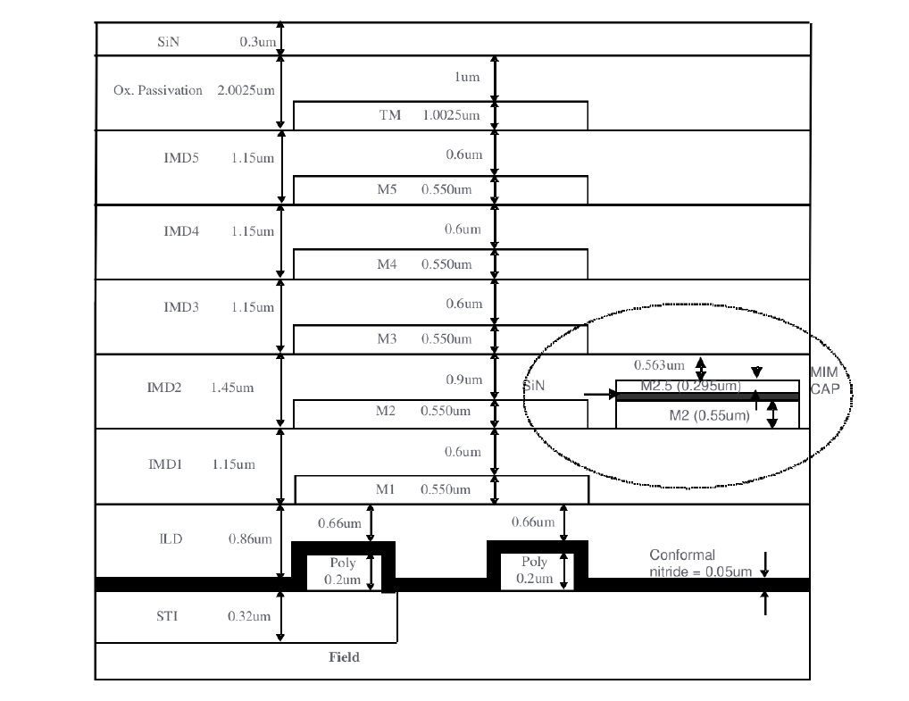
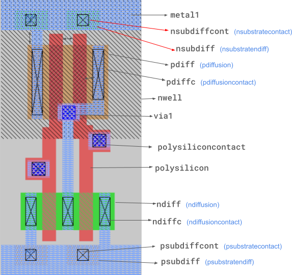

# Datasheet: GF180MCUD : 0.18um CMOS from Global Foundry

GlobalFoundries’ 0.18 µm HV CMOS is a mixed-signal-friendly process with 3.3 V, 5 V, 6 V, and native 6 V NMOS devices on a P-type substrate. It supports flexible metal stacks (1P3M–1P6M), thick top metals for power, and includes analog-friendly components like MIM capacitors and high-resistance poly resistors.  
Model and Simulation Coverage:

* Transistor Model :  BSIM4.5  
* BJT Model:  Gummel-Poon (GP)  
* Process Corners :  TT, FF, SS, FS, SF  
* Temp Range:  \-40°C to 125 °C

The design kit supports comprehensive global and local mismatch statistical characterization.

**Official Source**: https://gf180mcu-pdk.readthedocs.io/en/latest/

## Table of Contents

- [Datasheet: GF180MCUD : 0.18um CMOS from Global Foundry](#datasheet-gf180mcud--018um-cmos-from-global-foundry)
- [Device Schematic Cross Section](#device-schematic-cross-section)
- [Active Devices](#active-devices)
  - [MOS Transistors](#mos-transistors)
  - [LVT, Native and Other transistors](#lvt-native-and-other-transistors)
- [Poly Resistors](#poly-resistors)
  - [Standard poly resistors](#standard-poly-resistors)
  - [High-sheet-resistance poly resistors](#high-sheet-resistance-poly-resistors)
  - [N-WELL RESISTOR](#n-well-resistor)
  - [Contact resistance](#contact-resistance)
- [MIM Capacitors](#mim-capacitors)
  - [MIM capacitor density](#mim-capacitor-density)
- [Diodes](#diodes)
  - [Junction diode models](#junction-diode-models)
- [Basic Design Rules](#basic-design-rules)
  - [Basic Layout Layers](#basic-layout-layers)
  - [Grid & geometry](#grid--geometry)
  - [Wells](#wells)
  - [Active (COMP)](#active-comp)
  - [Poly2gate](#poly2gate)
  - [Nplus / Pplus implants](#nplus--pplus-implants)
  - [Contacts](#contacts)
  - [Metal layers (Metal1–Metal5)](#metal-layers-metal1metal5)
  - [Vias (Via1–Via5)](#vias-via1via5)
- [Standard Cell Libraries](#standard-cell-libraries)
  - [7 track Standard Cells](#7-track-standard-cells)
  - [9 track Standard Cells](#9-track-standard-cells)

# Device Schematic Cross Section

MIM was placed in between Metal2 and Metal3; SIN=0.042um for 1.5fF, SIN=0.062um for 1.0fF

# Active Devices

## MOS Transistors

| Parameter | NMOS 3.3 V (nfet\_03v3) | PMOS 3.3 V (pfet\_03v3) |
| :---- | :---: | :---: |
| Minimum (L) | 0.28 µm | 0.28 µm |
| Vt0 (typ) | 0.63 V | −0.73 V |
| Idsat | 510 µA/µm | 250 µA/µm |
| Ioff (25°C) | 1 pA/µm | 1 pA/µm |
| BVDSS (typ) | 9 V | −8.5 V |
| Model Coverage | BSIM4.5 scalable | BSIM4.5 scalable |
| Characterization | Full corner & mismatch | Full corner & mismatch |

             

## LVT, Native and Other transistors

| Parameter | NMOS 5 V (nfet\_05v0) | PMOS 5 V (pfet\_05v0) |
| :---- | :---: | :---: |
| Stack option | 1P1M | 1P1M |
| Minimum (L) | 0.60 µm | 0.50 µm |
| VDD range | 1.62 – 5.5 V | 1.62 – 5.5 V |
| Idsat @ 5 V | 500 µA/µm | 500 µA/µm |
| Well option | Outside DNWELL | Outside DNWELL |

    

| Parameter | Native NMOS 6 V (nfet\_06v0\_nvt) | NMOS 6 V (nfet\_06v0) | PMOS 6 V (pfet\_06v0) |
| :---- | :---: | :---: | :---: |
| Minimum L | 1.8 µm | 0.70 µm | 0.55 µm |
| Vt0 (typ) | −0.32 V to \+0.08 V | 0.73 V | 0.73 V |
| Idsat @ 6 V | 535 µA/µm | 570 µA/µm | 570 µA/µm |
| Ioff (25 °C) | — | 1 pA/µm | 1 pA/µm |
| BVDSS (typ) | 12 V | 11 V | 11 V |

# Poly Resistors

## **Standard poly resistors**

| Device Model (Primitive) | Resistor Type | Rs (Typ.) |        Rs Range |     TCR | V\_max (Op.) |
| :---- | :---- | ----- | ----- | ----- | :---- |
| npolyf\_s | N+ Poly (Salicided) | 6.8 Ω/sq | 1–15 Ω/sq | — | 3.3 V |
| ppolyf\_s | P+ Poly (Salicided) | 7.3 Ω/sq | 1–15 Ω/sq | — | 3.3 V |
| npolyf\_u | N+ Poly (Unsalicided) | 310 Ω/sq | 250–370 Ω/sq | Low | 3.3/6 V |
| ppolyf\_u | P+ Poly (Unsalicided) | 350 Ω/sq | 280–420 Ω/sq | Low | 3.3/6 V |
| nplus\_u | N+ Diff. (Unsalicided) | 60 Ω/sq | 45–75 Ω/sq | — | 3.3/6 V |
| pplus\_u | P+ Diff. (Unsalicided) | 185 Ω/sq | 145–225 Ω/sq | — | 3.3/6 V |

 **Resistors employ 3-terminal SPICE modeling. Salicide blocking is implemented via the SAB layer (GDS \#49). Models support comprehensive corner and mismatch characterization from –40°C to \+125°C.**

## **High-sheet-resistance poly resistors **

**NOTE**: requires additional L63 mask layer

- **Option A** 
  - 1 kΩ/sq poly resistor (P-poly)  
  - Rsheet (typ): 1000 Ω/sq  
  - Rsheet range: 800–1200 Ω/sq  
  - TCR1 (max): –800 ppm/K  
  - VCR1 (typ): –200 ppm/V  
  - Minimum (W): \> 3 µm
  - **Primitive Model**: (ppolyf\_u\_1k),(ppolyf\_u\_1k\_6p0)  

- **Option B** 
  - 2 kΩ/sq poly resistor (P-poly)  
  - Rsheet (typ) : 2000 Ω/sq  
  - Rsheet range : 1600–2400 Ω/sq  
  - TCR1 (typ) : –1650 ppm/K  
  - VCR1 (typ) : –150 ppm/V  
  - Minimum (W) : \> 3 µm
  - **Primitive Model**: (ppolyf\_u\_2k),(ppolyf\_u\_2k\_6p0)
         
- **Option C** 
  - 3 kΩ/sq poly resistor (P-poly)  
  - Rsheet (typ)       :         3000 Ω/sq  
  - Rsheet range     :         2250–3750 Ω/sq  
  - TCR1 (typ)         :         Not specified  
  - VCR1 (typ)         :         Not specified  
  - Minimum (W)     :         \> 3 µm
  - **Primitive Model**: (ppolyf\_u\_3k)

## **N-WELL RESISTOR**

- Rsheet (typ): 1000 Ω/sq  
- Rsheet range: 800–1200 Ω/sq  
- Max voltage: 6 V
- **Primitive Model**: (nwell

## **Contact resistance**

- M1–Poly (salicided): 5.9 Ω/cont  
- M1–N+ (salicided)  : 6.3 Ω/cont  
- M1–P+ (salicided)  : 5.2 Ω/cont  
- Via 1 – Via 5:  4.5 Ω/via  
- Contact size :  0.22 × 0.22 µm

**NOTE** Maximum contact resistance is specified at 15 Ω for all device types. Models support comprehensive characterization across the full operating temperature range.

# MIM Capacitors

## **MIM capacitor density** 

| Parameter | 1.0 fF/µm² | 1.5 fF/µm² | 2.0 fF/µm² | Unit |
| :---- | ----: | ----: | ----- | :---- |
| Capacitance density (typ) | 1.0 | 1.5 | 2.0 | fF/µm² |
| Capacitance range | 0.9–1.1 | 1.27–1.73 | 1.8–2.2 | fF/µm² |
| Leakage current | ≤ 1 at 16 V | ≤ 1 at 6 V | ≤ 1 at 6 V | pA/µm² |
| Breakdown voltage BVox (typ) | 40 | 30 | 24 | V |
| Max operating voltage | 20 | 10 |                  6.6 | V |
| Voltage coeff. Vc1 (typ) | 6.0 | 7.6 | 28.8 | ppm/V |
| Temp. coeff. TC1 (typ) | 10 | 13.3 | 18.8 | ppm/K |
| Bottom plate sheet Rs (typ) | 80 | 80 | 80 | mΩ/sq |
| Top plate sheet Rs (typ) | 500 | 500 | — | mΩ/sq |
| Matching (adjacent, C \= 1 pF) | ≤ 1% | ≤ 1% | ≤ 1% | % |

**NOTE**: Test structure: 350 × 50 µm² capacitor at zero bias. Characterisation performed at 25°C. MIM cap sits between M2–M3 (or M3–M4). **Requires extra mask layer L92.**

1. **1.0 fF/µm² Usage Scenario**

- Max Operating Voltage : up to 20 V  
- Voltage Coeff. Vc1 (typ) : 6.0 ppm/V  
- Typical Application : Power management, motor drive

2. **1.5 fF/µm² Usage Scenario**

- Max Operating Voltage : up to 10 V  
- Capacitance Density :  1.5 fF/µm²  
- Typical Application :  ADC, PLL, filters

3. **2.0 fF/µm² Usage Scenario**

- Max Operating Voltage :  up to 6.6 V (Max Area Efficiency)  
- Voltage Coeff. Vc1 (typ) :  28.8 ppm/V  
- Typical Application  :  Compact integrators

# Diodes

## **Junction diode models**

| Device Model (Primitive) | Junction Isolation | BV (Typ.) | V\_max (Op.) | SPICE Level |
| :---- | :---- | :---- | :---- | :---- |
| diode\_nd2ps\_03v3 | N+/P-sub (SGO) |    11 V |     3.3 V |    L-3 |
| diode\_pd2nw\_03v3 | P+/N-well (SGO) | –10.5 V |     3.3 V |    L-3 |
| diode\_nd2ps\_06v0 | N+/P-sub (DGO) |    11 V |     6.0 V |    L-3 |
| diode\_pd2nw\_06v0 | P+/N-well (DGO) | –10.5 V |     6.0 V |    L-3 |
| diode\_nw2ps\_03v3 | N-well/P-sub |    14 V |     3.3 V |    L-3 |
| diode\_nw2ps\_06v0 | N-well/P-sub |    14 V |     6.0 V |    L-3 |
| diode\_pw2dw | P-well/DNWELL |  \~10 V |     6.0 V |    L-3 |
| diode\_dw2ps | DNWELL/P-sub |  \~10 V |     6.0 V |    L-3 |
| sc\_diode | Schottky (NiSi/Si) |      — |     3.3 V |    L-3\* |

Primary junction characterization derived via SPICE Level 3 primitives. Thermal range: T\_amb \= –40°C to \+125°C (Static/Dynamic). Schottky breakdown thermal coefficients are null in current model release**.**  

# Basic Design Rules

## **Basic Layout Layers**

## **Grid & geometry**

* Design grid must be an integer multiple of 0.005 µm; all polygon edges must snap to this grid.   
* All shapes must be orthogonal or on 45° angles — no acute angles, no circular arcs (except pre-tested inductors). 

## **Wells**

* Min. DNWELL width: 1.70 µm; equi-potential spacing: 2.50 µm; different-potential spacing: 5.42 µm.   
* Every DNWELL must be surrounded by a PCOMP guard ring tied to P-substrate.   
* 3.3 V and 5/6 V transistors cannot share the same DNWELL.   
* Min. N-well width: 0.86 µm; N-well to DNWELL space: 3.10 µm.   
* 3.3 V and 5/6 V PMOS cannot sit in the same N-well. 

## **Active (COMP)**

* Min. COMP width: 0.22 µm (3.3 V) / 0.30 µm (5/6 V).   
* Min. COMP space: 0.28 µm (3.3 V) / 0.36 µm (5/6 V).   
* Min. source/drain overhang beyond gate: 0.24 µm (3.3 V) / 0.40 µm (5/6 V).   
* Every COMP shape must be covered by either Nplus or Pplus implant — uncovered active is a DRC error.   
* Max. distance from N-well tap to nearest PCOMP: 20 µm (3.3 V) / 15 µm (5/6 V). 

## **Poly2gate**

* Min. interconnect width: 0.18 µm (3.3 V) / 0.20 µm (5/6 V).   
* Min. gate length (channel length): 0.28 µm (3.3 V) · 0.60/0.50 µm (5 V N/P) · 0.70/0.55 µm (6VN/P).   
* Min. space on COMP or field: 0.24 µm for all voltages.   
* Min. poly end-cap beyond COMP: 0.22 µm.   
* Poly2 must never bridge a 3.3 V region to a 5/6 V region — use metal interconnect instead.   
* 90° bends of poly on active are forbidden; min. 45° bend gate width: 0.30 µm (3.3 V) / 0.70 µm (5/6V).   
* Die-wide poly coverage must be ≥ 14% — add dummy poly fill if below this threshold. 

## **Nplus / Pplus implants**

* Min. width and space for both: 0.40 µm.   
* Min. overlap of respective gate: 0.23 µm.   
* Min. overlap of unsalicided poly or COMP: 0.18 µm.   
* Min. area: 0.35 µm² for both Nplus and Pplus. 

## **Contacts** 

* Fixed size: 0.22 × 0.22 µm (min \= max — no deviation allowed).   
* Min. space: 0.25 µm; in a 4×4 or larger array: 0.28 µm.   
* Poly2 and COMP overlap of contact: 0.07 µm each.   
* Metal1 overlap of contact: 0.005 µm general; 0.06 µm for end-of-line (metal width \< 0.34 µm).   
* Contacts on the poly gate over COMP, on field oxide, or straddling an N+/P+ butting edge are all forbidden. 

## **Metal layers (Metal1–Metal5)**

* Min. Metal1 width and space: 0.23 µm.   
* Min. Metal2–5 width and space: 0.28 µm.   
* Additional space to any wide metal shape (length and width \> 10 µm): 0.30 µm.   
* Min. metal area: 0.1444 µm² for all layers.   
* Die-wide metal coverage must be ≥ 30% per layer — add dummy metal fill if below threshold. 

## **Vias (Via1–Via5)**

* Fixed size: 0.26 × 0.26 µm (min \= max).   
* Min. space: 0.26 µm; in a 4×4 or larger array: 0.36 µm.   
* Metal below overlap of via: 0.00 µm (Metal1) / 0.01 µm (Metal2–5); end-of-line overlap: 0.06 µm.   
* Via stacking (via directly above contact or adjacent via) is permitted.   
* Always use multiple vias per connection — single vias are a reliability risk. 

# Standard Cell Libraries

## 7 track Standard Cells

**5V Databook Setup and Conditions**

| Process Corner : Typical  |
| :---- |
| **Voltage** **:** 5.00 volt |
| **Temperature :** 25.0 °C |

**Physical Specifications**

| Process Scheme (\#Poly/\#Metal) | 1P1M |
| :---- | :---- |
| Device Type | 5V NMOS & 5V PMOS |
| Drawn Gate Length PMOS/NMOS(um) | 0.50/0.60 |
| Layer of Poly | 1 |
| Well Option | Outside DNWELL |
| Layer Grid (um) | 0.005 |
| Tracks per Cell | 7 |
| Cell Height (um) | 3.92 |
| Vertical/Horizontal Pin Grid (um) | 0.56 |

**Electrical Specifications**

| Operating Voltage | VDD \= 1.62 \- 5.5V |
| :---- | :---- |
| Operation Temperature | \-40°C to 125°C |

**Maximum Transition**  
Lesser of 20% clock period or recommended value below

| Process | Temperature | VDD Voltage | Max Transition |
| :---: | ----- | ----- | ----- |
| SS | \-40°C | 4.5V | 1.25ns |
| SS | 125°C | 4.5V | 1.75ns |
| TT | 25°C | 5.0V | 1.00ns |
| FF | \-40°C | 5.5V | 0.65ns |
| FF | 125°C | 5.5V | 0.85ns |
| SS | \-40°C | 3.0V | 2.75ns |
| SS | 125°C | 3.0V | 3.90ns |
| TT | 25°C | 3.3V | 2.15ns |
| FF | \-40°C | 3.6V | 1.30ns |
| FF | 125°C | 3.6V | 1.85ns |
| SS | \-40°C | 1.62V | 5.25ns |
| SS | 125°C | 1.62V | 6.25ns |
| TT | 25°C | 1.8V | 3.00ns |
| FF | \-40°C | 1.98V | 1.70ns |
| FF | 125°C | 1.98V | 2.23ns |

**PVT Characterization Corners**

| Process | Temperature | VDD Voltage | PEX |
| :---: | ----- | ----- | ----- |
| SS | \-40°C | 4.5V | Worst RC |
| SS | 125°C | 4.5V | Worst RC |
| TT | 25°C | 5.0V | Typical RC |
| FF | \-40°C | 5.5V | Best RC |
| FF | 125°C | 5.5V | Best RC |
| SS | \-40°C | 3.0V | Worst RC |
| SS | 125°C | 3.0V | Worst RC |
| TT | 25°C | 3.3V | Typical RC |
| FF | \-40°C | 3.6V | Best RC |
| FF | 125°C | 3.6V | Best RC |
| SS | \-40°C | 1.62V | Worst RC |
| SS | 125°C | 1.62V | Worst RC |
| TT | 25°C | 1.8V | Typical RC |
| FF | \-40°C | 1.98V | Best RC |
| FF | 125°C | 1.98V | Best RC |

## 9 track Standard Cells 

**5V Databook Setup and Conditions**

| Process Corner : Typical  |
| :---- |
| **Voltage** **:** 5.00 volt |
| **Temperature :** 25.0 °C |

**Physical Specifications**

| Process Scheme (\#Poly/\#Metal) | 1P1M |
| :---- | :---- |
| Device Type | 5V NMOS & 5V PMOS |
| Drawn Gate Length PMOS/NMOS(um) | 0.50/0.60 |
| Layer of Poly | 1 |
| Well Option | Outside DNWELL |
| Layer Grid (um) | 0.005 |
| Tracks per Cell | 9 |
| Cell Height (um) | 5.04 |
| Vertical/Horizontal Pin Grid (um) | 0.56 |

**Electrical Specifications**

| Operating Voltage | VDD \= 1.62 \- 5.5V |
| :---- | :---- |
| Operation Temperature | \-40°C to 125°C |

**Maximum Transition**  
Lesser of 20% clock period or recommended value below

| Process | Temperature | VDD Voltage | Max Transition |
| :---: | ----- | ----- | ----- |
| SS | \-40°C | 4.5V | 1.30ns |
| SS | 125°C | 4.5V | 1.80ns |
| TT | 25°C | 5.0V | 1.00ns |
| FF | \-40°C | 5.5V | 0.70ns |
| FF | 125°C | 5.5V | 0.90ns |
| SS | \-40°C | 3.0V | 2.00ns |
| SS | 125°C | 3.0V | 2.80ns |
| TT | 25°C | 3.3V | 1.50ns |
| FF | \-40°C | 3.6V | 0.95ns |
| FF | 125°C | 3.6V | 1.30ns |
| SS | \-40°C | 1.62V | 4.25ns |
| SS | 125°C | 1.62V | 5.00ns |
| TT | 25°C | 1.8V | 3.00ns |
| FF | \-40°C | 1.98V | 1.50ns |
| FF | 125°C | 1.98V | 2.10ns |

**PVT Characterization Corners**

| Process | Temperature | VDD Voltage | PEX |
| :---: | ----- | ----- | ----- |
| SS | \-40°C | 4.5V | Worst RC |
| SS | 125°C | 4.5V | Worst RC |
| TT | 25°C | 5.0V | Typical RC |
| FF | \-40°C | 5.5V | Best RC |
| FF | 125°C | 5.5V | Best RC |
| SS | \-40°C | 3.0V | Worst RC |
| SS | 125°C | 3.0V | Worst RC |
| TT | 25°C | 3.3V | Typical RC |
| FF | \-40°C | 3.6V | Best RC |
| FF | 125°C | 3.6V | Best RC |
| SS | \-40°C | 1.62V | Worst RC |
| SS | 125°C | 1.62V | Worst RC |
| TT | 25°C | 1.8V | Typical RC |
| FF | \-40°C | 1.98V | Best RC |
| FF | 125°C | 1.98V | Best RC |

----

:technologist: Amit Kumar Sharma (:link: Discord @amitkumarsharma0428)

:technologist: Subhransu Das (:link: Discord @0019subhu)
